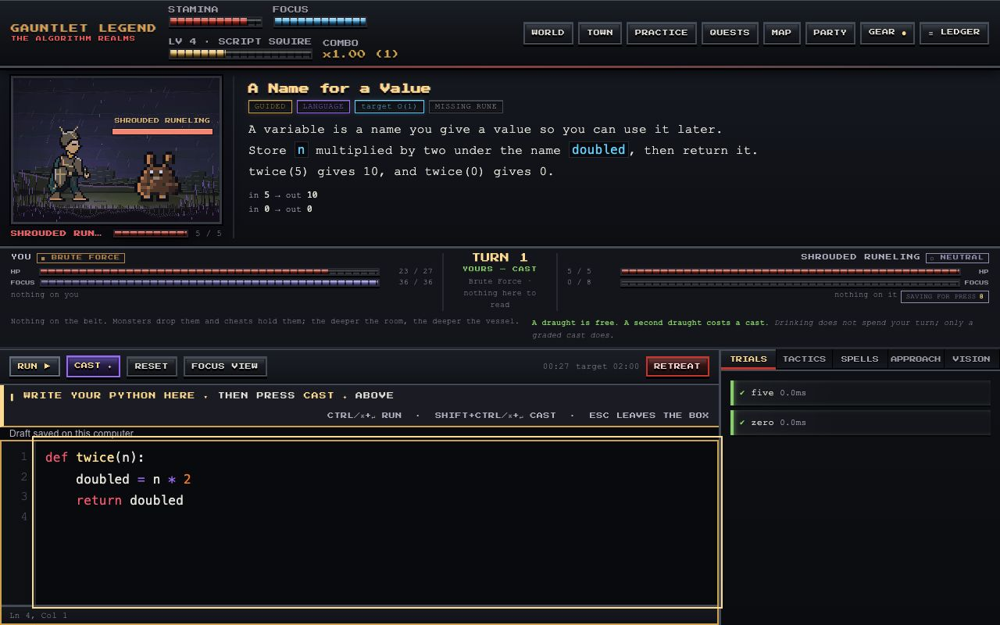

<div align="center">

# PYTHON CODING GAUNTLET LEGEND
### The Algorithm Realms

**An original pixel-art RPG for practicing real Python and interview problem solving.**

1,018 validated problems · 17 regions · 14 bosses · 16 dungeons · 74 quests · 6 classes
No accounts. No network. No dependencies. It all runs on your machine.

[Visit the game site and visual gallery](https://joseantoniopau.github.io/Python-Coding-Gauntlet-Legend/)

</div>

---

## The pitch

Practice starts with small expressions and builds toward complete functions,
debugging, data structures and timed practicals. Writing, testing and revisiting
Python drives the adventure. Progress reports distinguish supported practice
from unaided work and first encounters with sealed material.

The RPG systems give practice a setting and a purpose:

| The game thing | The learning thing underneath |
|---|---|
| Your attack | Python you type. Damage scales with how much the cast actually demanded |
| Enemy weaknesses | The problem's real edge cases |
| Enemy resistances | Its performance ceiling — brute force genuinely bounces off |
| Your companion | The hint system. Its tier caps how deep a hint can go |
| Memory shrines | Spaced repetition over *patterns*, in disguised variants |
| Chapter gates | Evidence you can do the earlier thing unaided |
| Gold | Paid for graded Python. The best-paying loop in the game is fresh problems |
| The last boss | A timed practical, sealed, with every crutch removed |

---

## The graphics and practice overhaul



*Current gameplay from an isolated demonstration save. [More screenshots and art studies on the game site](https://joseantoniopau.github.io/Python-Coding-Gauntlet-Legend/).*

- **Original animated art:** a dedicated 40×48 battle hero with six poses,
  equipped previews, expressive portraits, distinct creature anatomy, transformed
  boss phases, 17 regional environments and four stages of town reconstruction.
  Layered cinematics use the characters actually present in their scripts.
- **Readable workspaces:** 16px code, a reversible focus view, keyboard-operated
  choices and file tabs, an offline display font, and motion effects confined to
  scene artwork.
- **Practice at your pace:** resumable 10, 20 or 40 minute expeditions and interview
  rehearsals. Choose balanced practice, review, a weak skill or fresh material.
  Pause or finish deliberately; ordinary code and explanation drafts can resume.
- **Learning records:** a personal grimoire with notes, previous attempts,
  assistance records and spaced-retention evidence. VISION can step through an
  actual bounded execution of your Python on a public example, with local values,
  calls, returns and generator suspension shown separately from concept demos.
- **More reasons to return:** constraint-changing boss rematches, companion
  journey panels, learning-earned cosmetic colors and Mini-Repo investigations
  with file diffs and ungraded hypothesis/evidence/regression notes.

Rehearsals are practice. Sealed assessment keeps its separate rules and finite
holdout pool. Explanation feedback reports topic coverage and quoted evidence;
it does not pretend to judge the quality of an interview answer.

Open `/art.html` on the running local server for the renderer gallery. It includes
animation, silhouette checks, cinematic fixtures and PNG frame export. The
[reference research](docs/15-reference-research.md) maps FFVI's actual mechanics
to this game; [art direction](docs/08-art-direction.md) records the original
visual contracts. Restoration archives were inspected as references; no ROM,
Final Fantasy artwork, soundtrack or patch code was imported.

See the [delivery and validation record](docs/16-polish-delivery.md) and the
[human playtest protocol](docs/17-playtest-protocol.md). Automated checks validate
specific behavior; human engagement and retained learning still require testing.

---

## It teaches the basics first, then ramps

The corpus is deliberately bottom-heavy, because the most common way a learning
game fails is opening at a difficulty that only helps people who don't need it.

```
GUIDED    258  ██████████████░░░░  fill in one expression
TUTORIAL  215  ████████████░░░░░░  guided, with the shape given
EASY      321  ██████████████████  on your own
MEDIUM    199  ███████████░░░░░░░  real interview weight
HARD       25  █░░░░░░░░░░░░░░░░░  the deep end
```

**Encounter one is "what does `print(10 - 4)` show?"** — four choices, no function,
no indentation, no `return`. The first twenty-two problems contain no function at
all. Seven of your first twenty encounters are rungs on a 57-step chain that
introduces one idea at a time, and no concept is used before it is taught.

If you already write Python, the diagnostic knows: ace its writing trial and you
start at chapter IV with eight EASY and three MEDIUM problems in your first
twenty instead.

**Coverage** spans the whole practical: comprehensions, slicing, unpacking, the
standard library you're expected to reach for, OOP and dunder methods,
generators, decorators, closures, context managers, exceptions, linked lists,
trees, graphs, DP, backtracking, greedy and bit manipulation — plus **Mini-Repo
Battles**, which hand you a 3–8 file project with tests and deliberately mediocre
code and ask you to add a feature or fix a bug without breaking anything.

---

## Transfer Readiness

Ordinary RPG mastery measures familiarity with material you were taught. That is
a number that flatters you.

So **122 of the 1,018 problems are sealed** — held out permanently, whole
lineages at a time, so no sealed problem has a teachable sibling. Adventure Mode,
hints, spaced repetition and the coach can never reach them. They appear only in
measured runs, cold.

**Transfer Readiness** is computed only from sealed problems, met unaided, the
first time that lineage was ever attempted. It refuses to print a percentage
until it has ten samples, and shows its confidence band. Attempting a sealed
problem spends it, pass or fail — the hold-out is finite by design.

---

## Run it

You need **Python 3.11+** and a browser. Nothing else — no `pip install`.

**macOS / Linux**
```bash
git clone https://github.com/joseantoniopau/Python-Coding-Gauntlet-Legend.git
cd Python-Coding-Gauntlet-Legend
python3 run.py
```

**Windows** — double-click **`Play on Windows.bat`**, or `py -3 run.py`.

> Installing Python on Windows? Tick **"Add python.exe to PATH"**.

A window opens on a local server bound to `127.0.0.1` with a per-session token.
Nothing is sent anywhere. `./scripts/build_app.sh` produces a double-clickable
macOS `.app`.

### Where your save lives

| Platform | Save directory |
|---|---|
| macOS | `~/Library/Application Support/GauntletLegend` |
| Windows | `%APPDATA%\GauntletLegend` |
| Linux | `~/.local/share/gauntlet-legend` |

---

## Running your code safely

Your solutions run in a separate process behind four independent layers:

1. **`sandbox-exec` seatbelt** (macOS) — denies all network, denies writes outside a scratch dir
2. **POSIX resource limits** — CPU seconds, address space, file size, process count
3. **A parent wall-clock kill** — for anything that gets past the first two
4. **A per-test timeout** — so one runaway test doesn't take the batch with it

`python3 run.py check` checks blocked networking and runaway-loop timeout, and
reports whether the platform's hardened sandbox is available. The broader
regression suite covers additional boundaries; this command is a smoke check.

> **On Windows, layers 1 and 2 do not exist.** There is no seatbelt and no
> `resource` module, so isolation there rests on process separation and the
> wall-clock kill. The code you run is code you wrote, so the threat model is
> "my own infinite loop shouldn't wedge the machine" — but it is genuinely weaker
> than the macOS path, and you should know that.

---

## Interview Mode is actually sealed

Adventure Mode teaches. Interview Mode measures. The isolation is enforced
**server-side**: the pattern label is redacted, and hints, probes, companions,
items, the smith, the coach and every one of the 142 endpoints that could help
are refused with a `409` naming the capability. A test suite scans thousands of
payloads to keep it that way.

The final practical is that mode with the clock on and every crutch gone. The
fourteen bosses before it each remove exactly one, so arriving with nothing is
something you were trained for rather than ambushed by.

And it is given a reason. Before the practical, the Null King casts **the Last
Courtesy** — fourteen small dispossessions, one per crutch, in the order the
bosses took them, ending with the Obliging Hand lifting off finger by finger
into his open palm. The hints go out. The mentor is *"not in the room. I have
not harmed them. I have stopped including them."* A clock is added, and it is
the only thing he adds.

The spell explains the seal; **it does not change it.** `gauntlet/unmaking.py`
holds no state, reads no save, and cannot reach `finalexam.sealed()`, which
remains the one capability check in the codebase. That is proven rather than
asserted: a composed exam is byte-identical across three worlds — the module
deleted, present-but-unimported, and imported first. Skipping the cinematic
changes nothing about the exam that follows.

---

## What's in it

| | |
|---|---|
| Problems | 1,018 validated · 896 teachable · 122 sealed |
| World | 17 regions · 16 dungeons · 16 Mini-Repos · 14 bosses · 17 roaming apex monsters |
| People | 34 quest NPCs · 12 mentors · 17 vendors · 16 sages · a healer, a smith and a broker |
| Progression | 6 classes · 126 skill nodes · 6 signature blades × 9 rungs · 11 metals · 96 secret arts |
| Companions | 12, tiered, one at a time · 31 pieces of regalia |
| Combat | Turn-based · 6 elements in 3 opposed pairs · 12 potions · status effects · durability |
| Content | 74 quests in 17 chains · 126 items · 22 artifacts |
| Bestiary | 57 authored creature bodies plus 3 fallbacks · 17 regional rosters · 6 boss phase stages |
| The taken | 27 people across 14 holdings · freed by the boss that took them |
| Stakes | Death rewinds the game and never the player · autosaves on region entry and boss kills |

---

## Two rewards, and they are not the same reward

Every region boss took somebody out of its village. **Beat that boss and those
specific people walk out** — with their own lines, the boon they hand you, the
road it opens, and what changes back home. A rematch frees nobody, because they
are already out.

**Passing the practical is the other one**, and it is the end of the game rather
than a payout: the Null King's index stops pointing, everyone still in a niche
gets up on their own, and the cutscene is a roll call of what you actually did.

The ending reports those two counts separately, using the people actually
recorded in the save. Its roll call distinguishes personal rescues from the
people released by the fall of the index.

You can still sit the practical from the menu at level one having freed nobody,
and it is the same sealed, timed, unassisted exam. It measures you; it does not
end the game. **The portal gates the story. The practical gates the ending.
Nothing gates the practical.**

---

## Development

```bash
python3 run.py check           # verify the sandbox
python3 run.py build-corpus    # rebuild and re-validate every problem
python3 run.py doctor          # diagnose an installation
```

Run the full Python suite with `python3 -B -m unittest discover -s tests -v`.
It runs real sandboxed programs and corpus simulations, so allow roughly
30–45 minutes. A focused module can be run with
`python3 -m unittest discover -s tests -p 'test_keys_and_seal.py'`.
Current counts and results are recorded in [the delivery report](docs/16-polish-delivery.md).

There is one more verifier that needs a running server, and it drives the real
client with no browser — the actual `web/js` modules, under an instrumented
canvas, against real HTTP:

```bash
GAUNTLET_DATA_DIR="$(mktemp -d)" python3 run.py serve --port 8801 &
node scripts/verify/headless.mjs 8801
```

It walks boot, twenty-one screens, the road to a boss, one silhouette per phase
and the practical at zero keys, and reports what rendered: draw calls, canvases
allocated in the loop, and the four failure classes a parse check cannot see.
Use a disposable save as shown: this harness changes progression and opens a
measured assessment.

Applicable coding problems carry a reference implementation to compute expected
outputs and a canonical solution shown to the player. Validation checks that
they agree. Reading and puzzle encounters use their own answer and structural
checks; they do not all contain two executable implementations.

---

## Credits and licence

Game artwork is **original and rendered procedurally at runtime**. The repository
also contains exported renderer studies for its public site. No art is copied
from an existing game. Art direction is in `docs/08-art-direction.md`, the story
in `docs/09-story-bible.md`.

Music is six licence-clear tracks from [Pixabay](https://pixabay.com/music/)
under the Pixabay Content License — nickpanek, alec_koff, Alex Morgan and
myshoun, credited in `web/audio/music/CREDITS.md`. The game synthesises its own
soundtrack as a fallback if they are absent.

Problems tagged as reported interview patterns are **historically reported
shapes, not guaranteed questions**, and name no company.

MIT — see [LICENSE](LICENSE).
